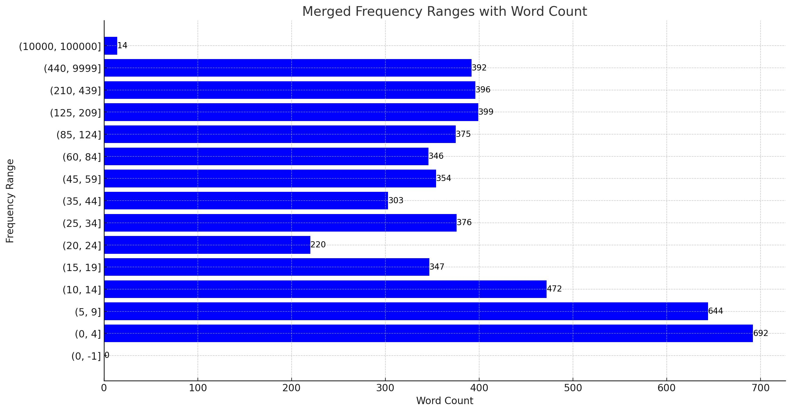
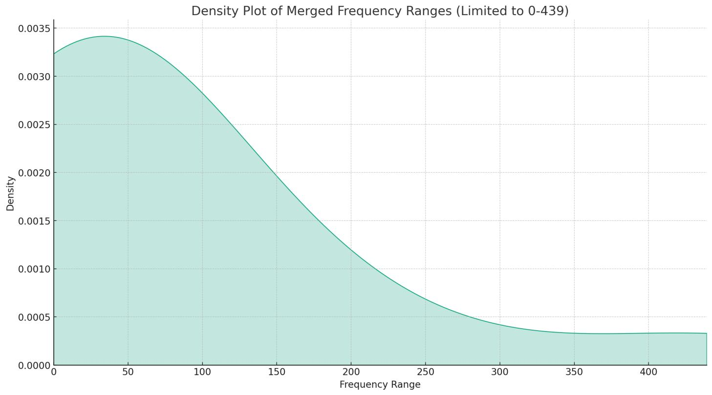
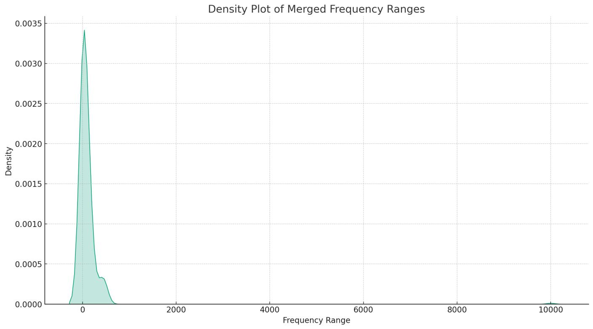
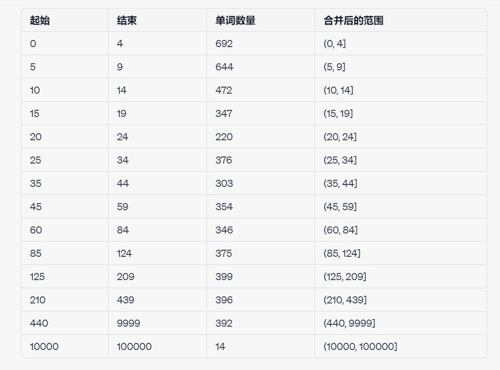

# **应试单词Python命令行程序**

## 做了什么
> 1.完成了对原作者单词集的数据分析，读者可以根据分析和可视化的图表来自行调整学习单词的方向

> 2.对原作者的单词集做了分割，按照出现频率分为了不同的json文件

> 3.编写了两个Python程序，分别可以对json文件进行陌生单词的摘录和阅读，注意摘录后的文件是json文件，可以与2中提到的文件一起被阅读程序可读化

## **数据来源**

以下内容转载自原作者仓库https://github.com/awxiaoxian2020/NETEMVocabulary

> 经统计，在《2023年全国硕士研究生招生考试英语（一）考试大纲词汇表》中要求掌握的词汇共5530个，根据六四级、考研英语、四专八约200套试卷文本，按照试卷文本中出现的词频对词汇表进行排序。  

> 排序使用了词形策略，因此与实际试卷还原呈现偏差。  

> 前2444个单词出现40次以上，即平均每做5套试卷就能遇到一次这些单词即为真正的高频词汇。  

> 高频词汇的释义经过人工校对，少数释义均是最常见的释义。  

## **数据分析**

**频率越大，重要性越高。**

**频率大于等于35是非常重要的单词界限，有2579个单词。**

> 下列的图表的数据再分析由本作者提供

### 图片

- 图1: 将范围合并过的 单词量-频率 一览图 
- 图2: 0-439的频率分布图 
- 图3: 全局的频率分布图 
- 图4: 格式化的表格 

## **两个程序的使用**
> 需要vscode和python编译器的环境 

> 建议将vscode中的对应python程序同根目录下的设置为"console": "externalTerminal",以便获得最好的阅读效果，否则默认在小控制台显示，观看效果较差。

> 运行程序之后，windows10可以点击F11来实现全屏浏览。注意：这个快捷键是针对所有的应用，并不只针对本程序。
 
### (Flle)JudgeEnWords.py

在本地运行后，按照提示输入json对应的本地地址，json文件是在`(Files json) Words_segmaned`文件夹中。  
程序会对json文件中的内容给出中文和英文的显示，请根据提示来完成是否存入即将输出在同一目录下的文件夹的文件。  
即将存入的文件夹是json格式的。对每一个单词的提示的逻辑为，1为没记住这个单词，输入任意字母可以跳过这个单词，说明掌握。

### (Screen)ReadEnJson

在本地运行后，按照提示输入json对应的本地地址，json文件是在`(Files json) Words_segmaned`文件夹中，或者`(Flle)JudgeEnWords.py`生成的文件。  
对应读取的每一个单词可以选择Enter键点击下一个或者点击q退出。

## **特别事项**

感谢**GPT-4**的支持与帮助。
